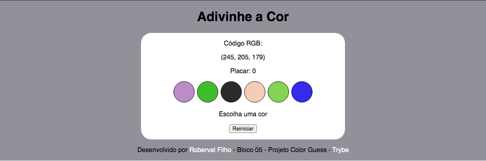

# Projeto Color Guess

Data: 09/05/2021

Tempo de curso: 1 mês e 4 dias

O objetivo deste projeto era desenvolver uma aplicação onde seria possível jogar um jogo de adivinhação de cores, acumulando a pontuação do jogador. Nesse projeto utilizei `HTML`, `CSS`, `JavaScript`.

# Habilidades

- Manipular o DOM.

- Manipular o Javascript.

- Manipular o CSS.

# Arquivos desenvolvidos

- `index.html`
- `style.css`
- `script.js`

# Imagem

## Requisitos Obrigatórios:

Neste projeto, você implementará um adivinhador de cor RGB. Ou seja, dada uma string RGB, você irá fornecer 6 alternativas visuais de cores, sendo uma delas a correta! Você poderá estilizar seu projeto da **forma que desejar** desde que todos os requisitos sejam cumpridos. Use sua imaginação! 🧠

---

## Requisitos do projeto

### 1 - Adicione no seu site um título com o nome do seu jogo

**O que será verificado:**

- Será verificado se o **id** do título é `title`.

### 2 - Adicione um texto com o código RGB a ser adivinhado

**O que será verificado:**

- Será verificado se o seu id deve ser rgb-color;

- Será verificado se o texto deve conter os três números das cores RGB a ser adivinhada, no seguinte formato: `(168, 34, 1)`.

### 3 - Adicione a página opções de cores para serem adivinhadas

**O que será verificado:**

- Será verificado que deve conter 6 circulos como opção de cor de adivinhação;

- Será verificado que a class de todos os circulos deve ser ball.

### 4 - Adicione cores nas bolas elas devem ser geradas dinâmicamente

**O que será verificado:**

- Será verificado que ao carregar a página, as cores de cada um dos 6 circulos coloridos deve ser geradas via JavaScript.

### 5 - Clicar em um circulo colorido, deve ser mostrado um texto indicando se está correto

**O que será verificado:**

- Será verificado que o seu **id** do elemento deve ser `answer`;

- Será verificado que quando o jogo é iniciado, o texto exibido deve ser `"Escolha uma cor"`;

- Será verificado se o circulo colorido for o **correto**, deve ser exibido o texto "Acertou!";

- Será verificado se o circulo colorido for o **incorreta**, deve ser exibido o texto "Errou! Tente novamente!".

### 6 - Crie um botão para iniciar/reiniciar o jogo

**O que será verificado:**

- Será verificado que o botão deve ter o id reset-game;

- Será verificado que ao clicar no botão, novas cores devem ser geradas via JavaScript e o elemento rgb-color deve ser atualizado;

- Será verificado que ao clicar no botão, o elemento answer deve voltar ao estado inicial, exibindo o texto "Escolha uma cor".

## BÔNUS

### 7 - Crie um placar que incremente 3 pontos para cada acerto no jogo

**O que será verificado:**

- Será verificado que o elemento deve ter o **id** `score`;

- Será verificado que o valor inicial dele deve ser 0;

- Será verificado que a cada acerto, é incrementado 3 pontos ao placar;

- Será verificado que ao clicar no botão reiniciar, o placar NÃO deve ser resetado.
